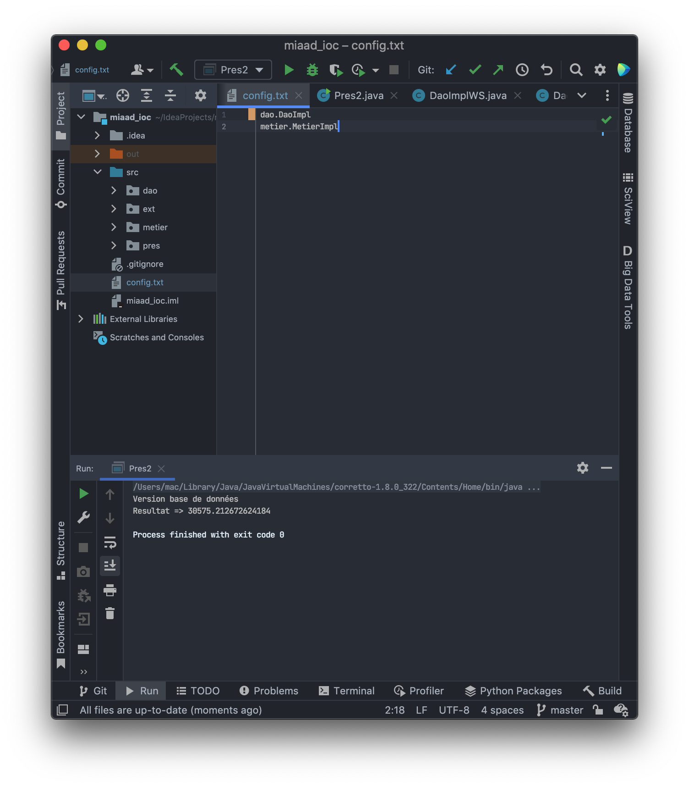
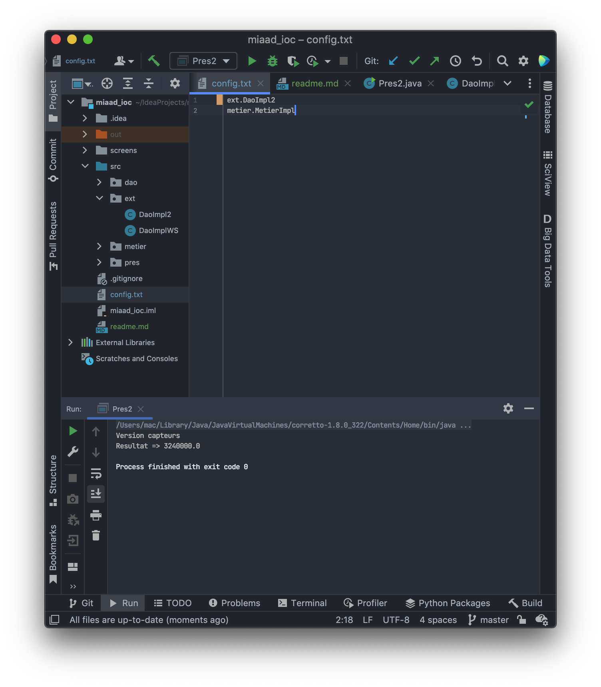
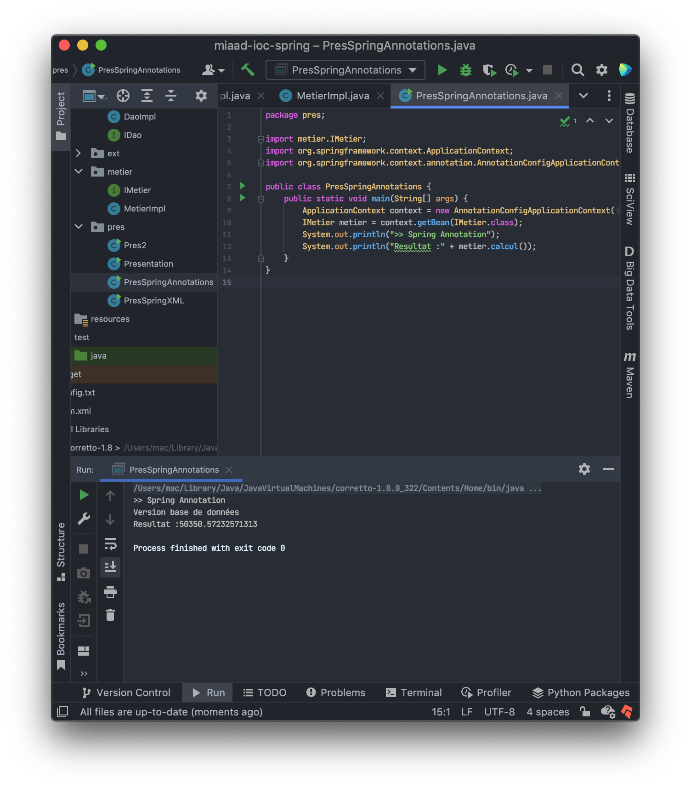
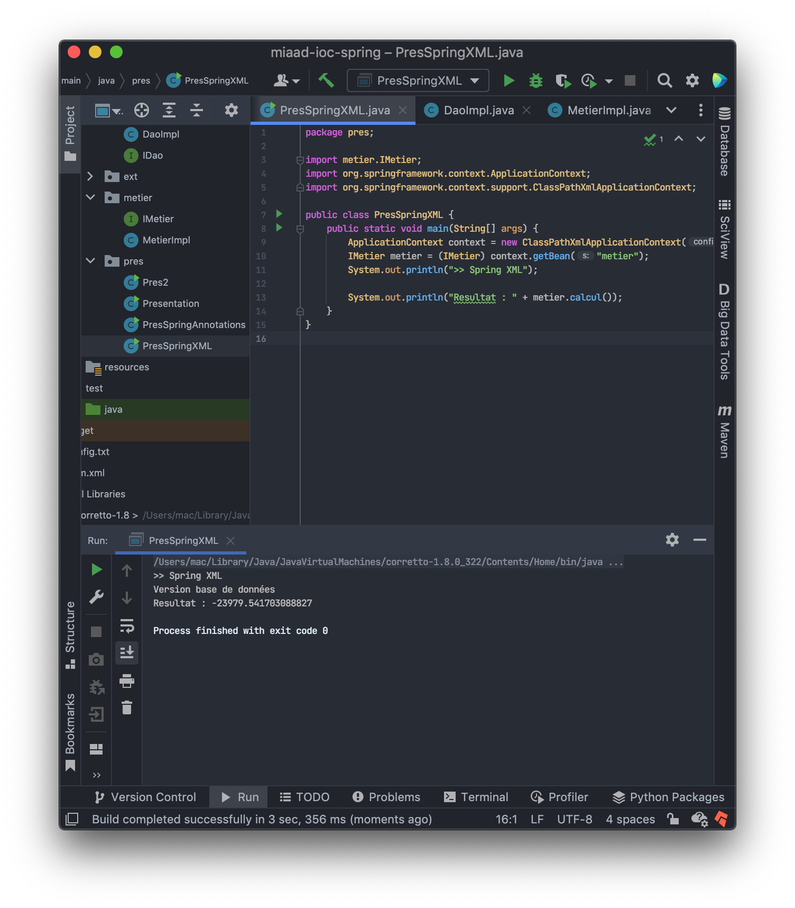
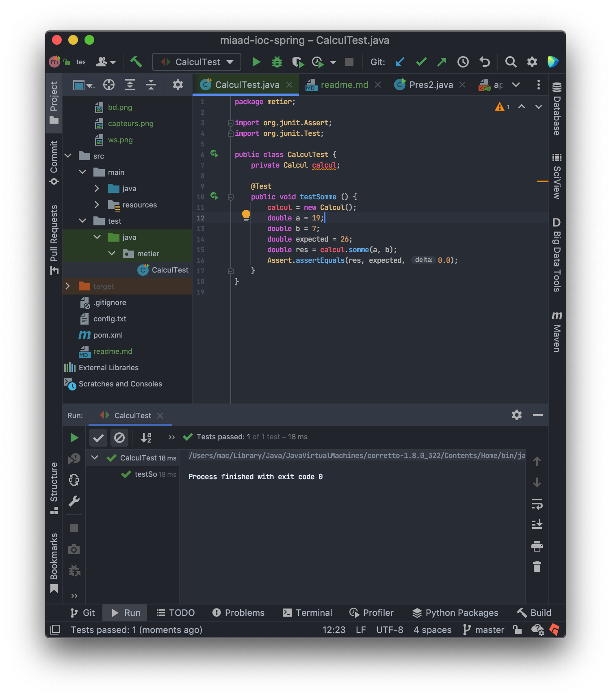

# **_Rapport de IOC [Spring Boot]_**

## Partie 1

Dans cet partie, l'instanciation de class presentation est faite d'une manier classis. Utilisons l'approche `ClassName obj = new ClassName();`
Et cet approche n'est pas pratique dand IOC.

## Partie 2

C'est pour cela on utilise la déclaration dynamique à l'aide d'un fichier `config` qui contient les noms de chaque classe qu'on a besoin.
Et par la suite on peux voir comment on peux basculer entre les trois versions d'obtenir les données à partier de DAO.

### Version base de données

### Version capteurs

### Version Web Service

#3 Partie 3

Dans cet partie, avec utilisation du spring boot. On fait deux techniques pour lancer notre projet avec une déclaration dynamique.

### Version Annotation

### Version XML

## Partie 4

Parmi les commandes de cycle de vie de l'outil `MAVEN` le projet management de notre projet Java Spring.
On a la commande `test` qui nous permet de tester notre code comme l'exemple suivant:

### Validation du Test d'une fonction qui fait la somme de deux nombre réels

